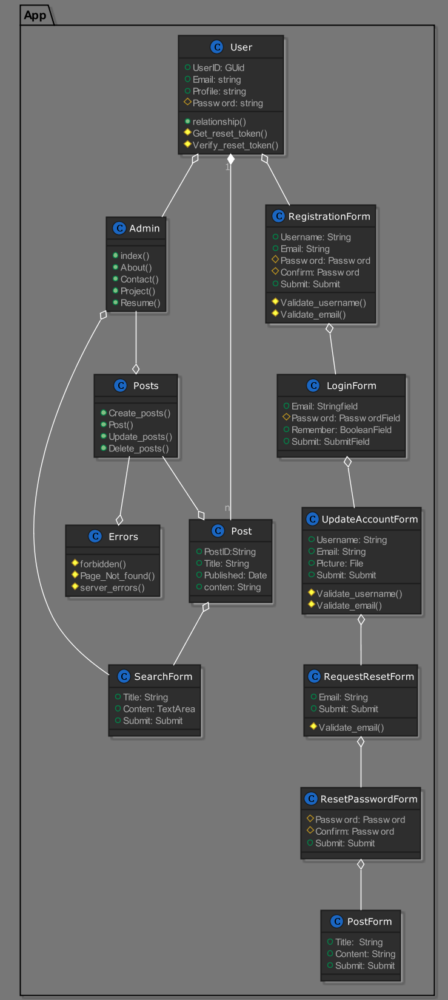
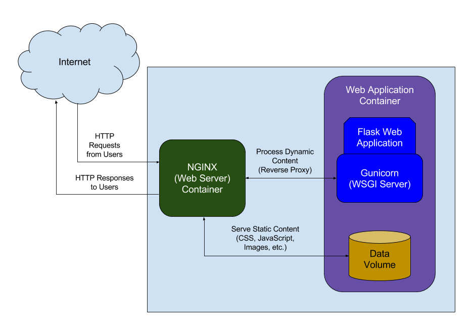

# System Application Portfolio

## Run To config

```docker
docker-compose config
```

## Run To build

```docker
docker-compose build
```

## Run To rebuild

```docker
docker-compose up --build
docker-compose up -d  
```

## Run To stop

```docker
docker-compose stop
```

## Run To remove

```docker
docker-compose rm
docker-compose down
```

## Image For Plantuml

```docker
Plantuml Class Diagram
```



## NGINX, Flask Web Application

```docker
NGINX Web Server 
```


